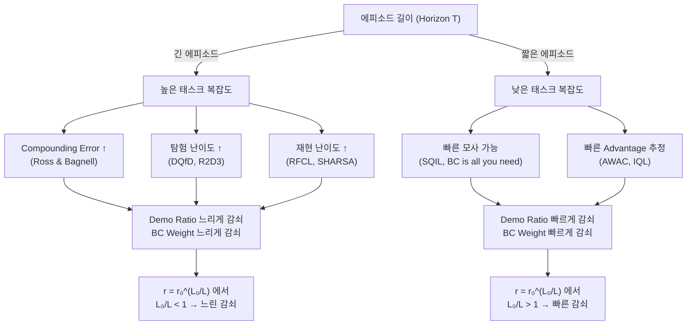

# 에피소드 길이 ↔ 데모 의존도 관련 탑 티어 연구 정리

## 핵심 가설 요약

> **에피소드가 길다** = Sparse reward 경로가 길다 = 태스크가 복잡하다 = 재현 자체가 어렵다
> → **데모를 오래, 강하게** 유지하여 어려운 궤적을 충분히 숙달시켜야 한다.
>
> **에피소드가 짧다** = 빠르게 모사 가능하다 = 데모를 넘어서 더 효율적인 행동 탐색이 중요하다
> → **데모를 빨리 줄여** 에이전트가 자체 탐험을 시작하도록 해야 한다.

이 가설은 아래 세 가지 이론적 축에 걸쳐 있으며, 각각에 대해 탑 티어 컨퍼런스 연구를 정리합니다.

---

## 축 1: Horizon이 길수록 Behavior Cloning의 오차가 폭발한다 (Compounding Error)

이 축이 가장 근본적인 이론적 근거입니다. Horizon이 길수록 BC만으로는 안 되고, 동시에 BC의 도움 없이 RL만으로도 안 됩니다.

### 📄 Ross & Bagnell — "A Reduction of Imitation Learning and Structured Prediction to No-Regret Online Learning" (AISTATS 2011)

| 항목 | 내용 |
|------|------|
| **학회** | AISTATS 2011 |
| **핵심** | BC의 누적 오차가 $O(\epsilon T^2)$로 **Horizon $T$에 대해 2차적으로 폭발**함을 이론적으로 증명 |
| **알고리즘** | **DAgger** (Dataset Aggregation) — 학습자의 실제 분포에서 전문가 라벨을 반복적으로 수집하여 $O(T)$로 줄임 |
| **연결고리** | 에피소드가 길수록 BC/Teaching Force의 단순 적용은 compounding error를 일으킴. 따라서 긴 에피소드에서는 **BC를 더 오래 유지하되, 점진적으로 RL로 전환**해야 하는 이유의 이론적 근거. 반면 짧은 에피소드에서는 $T$가 작으므로 compounding error 자체가 작아, 빠르게 BC를 놓고 RL 탐험으로 전환해도 안전함 |

> [!IMPORTANT]
> 이 논문이 제시하는 $O(\epsilon T^2)$ 바운드는 여러분의 가설에 대한 가장 직접적인 이론적 정당화입니다. 긴 horizon에서는 에이전트가 데모를 정확히 따르지 못하면 상태 공간에서 빠르게 벗어나므로, teaching force를 더 강하고 오래 유지해야 합니다.

### 📄 Xu et al. — "Is Behavior Cloning All You Need?" (NeurIPS 2024)

| 항목 | 내용 |
|------|------|
| **학회** | NeurIPS 2024 |
| **핵심** | 특정 조건 하에서 BC의 sample complexity가 **horizon-independent**할 수 있음을 이론적으로 분석 |
| **연결고리** | 짧은 에피소드에서 BC가 "충분할 수 있다"는 이론적 근거를 제공하며, 이는 짧은 에피소드에서 BC weight를 빠르게 줄여도 된다는 가설을 간접 지지 |

---

## 축 2: Demo Ratio 조절 — 데모와 에이전트 데이터의 혼합 비율 스케줄링

### 📄 Gulcehre et al. — "Making Efficient Use of Demonstrations to Solve Hard Exploration Problems" (ICLR 2020, DeepMind)

| 항목 | 내용 |
|------|------|
| **학회** | ICLR 2020 |
| **알고리즘** | **R2D3** (Recurrent Replay Distributed DQN from Demonstrations) |
| **핵심** | 전문가 버퍼와 에이전트 버퍼를 분리하고, **demo ratio $\rho$** 로 샘플링 비율을 직접 제어. 양쪽 버퍼에 **독립적 priority** 적용 |
| **연결고리** | **여러분의 `WorldModelDemoRatio`와 구조적으로 가장 유사한 기존 연구**. R2D3는 $\rho$를 고정값으로 사용했지만, 이 값을 task complexity (≈ episode length)에 따라 동적으로 조절하는 것이 자연스러운 확장임. R2D3의 실험에서도 sparse reward + long horizon 태스크일수록 높은 $\rho$가 필요했음 |

> [!TIP]
> R2D3 논문에서 $\rho$를 다양하게 실험한 Figure를 보면, 어려운 태스크(긴 에피소드)에서는 높은 demo ratio가, 쉬운 태스크(짧은 에피소드)에서는 낮은 demo ratio가 최적이었음을 확인할 수 있습니다.

### 📄 Hester et al. — "Deep Q-learning from Demonstrations" (AAAI 2018)

| 항목 | 내용 |
|------|------|
| **학회** | AAAI 2018 |
| **알고리즘** | **DQfD** |
| **핵심** | 데모 데이터를 리플레이 버퍼에 영구 보존하고, **large margin classification loss**로 전문가 행동을 우선시하면서 동시에 RL 업데이트 수행 |
| **연결고리** | DQfD는 데모를 "절대 버리지 않지만" RL이 개선됨에 따라 자연스럽게 priority가 낮아지는 방식. Montezuma's Revenge 같은 극도로 긴 에피소드 + sparse reward에서 데모의 영구 보존이 성능에 결정적이었음 → **긴 에피소드에서는 데모를 오래 유지해야 한다**는 직접적 증거 |

### 📄 Ball et al. — "Efficient Online Reinforcement Learning with Offline Data" (ICML 2023)

| 항목 | 내용 |
|------|------|
| **학회** | ICML 2023 |
| **알고리즘** | **RLPD** (Reinforcement Learning with Prior Data) |
| **핵심** | Offline 데이터와 Online 경험을 **symmetric sampling** (50:50)으로 단순 혼합. 복잡한 pretraining 없이도 높은 sample efficiency 달성 |
| **연결고리** | 고정 비율로도 효과적이라는 점은, 비율 자체보다 **"언제까지 유지하느냐"가 더 중요**할 수 있음을 시사. 짧은 에피소드에서는 에이전트가 빠르게 데모 수준에 도달하므로 혼합 비율을 빨리 줄여야 하고, 긴 에피소드에서는 오래 유지해야 함 |

---

## 축 3: Teaching Force (BC Weight) 감쇠 스케줄링

### 📄 Rajeswaran et al. — "Learning Complex Dexterous Manipulation with Deep RL and Demonstrations" (RSS 2018)

| 항목 | 내용 |
|------|------|
| **학회** | RSS 2018 (ML 커뮤니티에서 탑 티어로 인정) |
| **알고리즘** | **DAPG** (Demo Augmented Policy Gradient) |
| **핵심** | Policy gradient loss에 BC loss를 **가중치 $\lambda$로 합산**하되, 학습이 진행됨에 따라 $\lambda$를 **감쇠**시켜 RL이 데모를 넘어서도록 유도 |
| **연결고리** | **여러분의 `BCWeightDecayRate`와 가장 직접적으로 대응되는 연구**. DAPG의 핵심 통찰은: "데모는 초기 탐험을 돕지만, 언젠가는 놓아줘야 에이전트가 더 나은 전략을 찾는다." 이때 $\lambda$의 감쇠 속도를 태스크 복잡도(에피소드 길이)에 비례하게 조절하는 것이 자연스러운 확장 |

### 📄 Nair et al. — "Accelerating Online RL with Offline Datasets" (2020, BAIR)

| 항목 | 내용 |
|------|------|
| **학회** | Preprint / BAIR 2020 |
| **알고리즘** | **AWAC** (Advantage Weighted Actor-Critic) |
| **핵심** | Offline→Online 전환 시 KL-divergence 제약으로 정책을 행동 데이터 근처에 묶어두되, advantage weighting으로 좋은 행동만 선택적 모방 |
| **연결고리** | Advantage가 높은 행동만 선택적으로 모방하므로, 에피소드가 짧아 advantage 신호가 빠르게 신뢰할 만해지면 BC 제약을 빨리 풀 수 있고, 에피소드가 길어 advantage 추정이 불안정하면 더 오래 제약을 유지해야 함 |

### 📄 Reddy et al. — "SQIL: Imitation Learning via RL with Sparse Rewards" (ICLR 2020)

| 항목 | 내용 |
|------|------|
| **학회** | ICLR 2020 |
| **알고리즘** | **SQIL** |
| **핵심** | 데모에 $r=+1$, 에이전트에 $r=0$을 부여하여 BC를 sparse reward RL 문제로 변환. 이론적으로 regularized BC와 동치 |
| **연결고리** | 데모의 "보상 신호"가 학습 전체에 걸쳐 일정하므로, 에피소드 길이가 길수록 데모의 $r=+1$ 신호가 더 많은 스텝에 걸쳐 퍼지며 강한 유인력을 가짐. 짧은 에피소드에서는 금방 에이전트가 $r=+1$을 스스로 얻을 수 있으므로 데모의 가치가 빠르게 감소 |

---

## 축 4: 커리큘럼 학습 — Episode Horizon 자체를 조절

### 📄 Tao et al. — "Reverse Forward Curriculum Learning for Extreme Sample and Demonstration Efficiency" (ICLR 2024)

| 항목 | 내용 |
|------|------|
| **학회** | ICLR 2024 |
| **알고리즘** | **RFCL** |
| **핵심** | Reverse curriculum (목표 근처에서 시작해 점차 뒤로 이동) + Forward curriculum (전체 초기 상태로 일반화). **1~10개의 데모만으로** 복잡한 조작 태스크 해결 |
| **연결고리** | "먼저 짧은 sub-episode에서 성공을 배우고, 점차 긴 horizon으로 확장"하는 방식 자체가, 짧은 구간에서는 데모에 덜 의존하고 긴 구간에서는 데모에 더 의존해야 한다는 가설과 정확히 일치 |

### 📄 "Horizon Reduction Makes RL Scalable" — SHARSA (NeurIPS 2025)

| 항목 | 내용 |
|------|------|
| **학회** | NeurIPS 2025 |
| **알고리즘** | **SHARSA** |
| **핵심** | 긴 horizon이 offline RL의 **확장성을 근본적으로 제한**한다는 것을 발견하고, horizon reduction으로 이를 해결 |
| **연결고리** | Horizon의 길이가 학습 난이도에 직접적으로 비례한다는 것을 대규모 실험으로 증명한 최신 연구. 긴 horizon에서 더 많은 지도(데모)가 필요하다는 가설의 경험적 지지 |

### 📄 Ren et al. — "Adaptive Episode Length Adjustment for Exploration" (arXiv / 2024)

| 항목 | 내용 |
|------|------|
| **핵심** | Entropy 기반으로 에피소드 길이를 동적으로 조절하여 탐험 효율을 높이는 **AELA** 방식 |
| **연결고리** | 에피소드 길이 자체가 학습 속도와 품질에 직접적인 영향을 미친다는 것을 보여줌. 짧은 에피소드에서 더 다양한 데이터 생성 → 데모 의존도 감소 가능 |

---

## 축 5: World Model 기반 방법 + 데모의 결합

### 📄 Hafner et al. — DreamerV3 (JMLR 2024 / NeurIPS 2023)

| 항목 | 내용 |
|------|------|
| **학회** | JMLR 2024 |
| **알고리즘** | **DreamerV3** |
| **핵심** | 도메인에 무관한 범용 world model. Symlog prediction으로 다양한 reward scale 처리 |
| **연결고리** | Drama 프로젝트의 베이스라인 아키텍처. DreamerV3는 데모를 명시적으로 다루지 않으므로, **데모 비율 스케줄링은 여러분의 고유한 contribution**이 됨 |

### 📄 Dreamer-CDP (ICML/ICLR 2026)

| 항목 | 내용 |
|------|------|
| **핵심** | JEPA 스타일의 reconstruction-free world model. 연속적, 결정적 표현 사용 |
| **연결고리** | World model의 발전 방향. 데모 데이터가 world model 학습에 미치는 영향은 world model의 표현 방식에 따라 달라질 수 있음 |

---

## 종합 정리 — 여러분의 가설을 지지하는 논거 구조

## 레퍼런스 요약 표

| # | 논문 | 학회 | 핵심 기여 | 관련성 |
|---|------|------|-----------|--------|
| 1 | Ross & Bagnell (DAgger) | AISTATS 2011 | BC 오차 $O(\epsilon T^2)$ → Horizon 의존적 | ⭐⭐⭐ 이론적 근거 |
| 2 | Xu et al. (Is BC All You Need?) | NeurIPS 2024 | Horizon-independent BC 가능 조건 | ⭐⭐ 짧은 에피소드 근거 |
| 3 | Gulcehre et al. (R2D3) | ICLR 2020 | Demo ratio $\rho$ + 이중 버퍼 | ⭐⭐⭐ 구조적 유사성 |
| 4 | Hester et al. (DQfD) | AAAI 2018 | 데모 영구 보존 + priority replay | ⭐⭐⭐ 긴 에피소드 근거 |
| 5 | Ball et al. (RLPD) | ICML 2023 | Symmetric sampling offline+online | ⭐⭐ 비율 스케줄링 |
| 6 | Rajeswaran et al. (DAPG) | RSS 2018 | BC weight $\lambda$ 감쇠 | ⭐⭐⭐ BCWeightDecay 직접 대응 |
| 7 | Nair et al. (AWAC) | Preprint 2020 | KL-제약 + advantage weighting | ⭐⭐ Advantage 추정 안정성 |
| 8 | Reddy et al. (SQIL) | ICLR 2020 | BC를 sparse reward RL로 변환 | ⭐⭐ 에피소드 길이와 보상 밀도 |
| 9 | Tao et al. (RFCL) | ICLR 2024 | Reverse-Forward 커리큘럼 | ⭐⭐⭐ Horizon 기반 커리큘럼 |
| 10 | SHARSA | NeurIPS 2025 | Horizon reduction → scalability | ⭐⭐⭐ Horizon이 근본 병목 |
| 11 | Hafner et al. (DreamerV3) | JMLR 2024 | 범용 world model | ⭐⭐ 베이스라인 아키텍처 |

> [!NOTE]
> 위 논문들 중 **에피소드 길이에 따라 데모 비율/BC weight의 감쇠 속도를 동적으로 조절**하는 것을 명시적으로 연구한 논문은 아직 없습니다. R2D3, DAPG 등이 각각 demo ratio와 BC weight를 다루지만, 이 두 값을 **에피소드 길이의 함수로 자동 결정**하는 접근은 여러분의 **고유한 기여(contribution)**가 될 수 있습니다.
